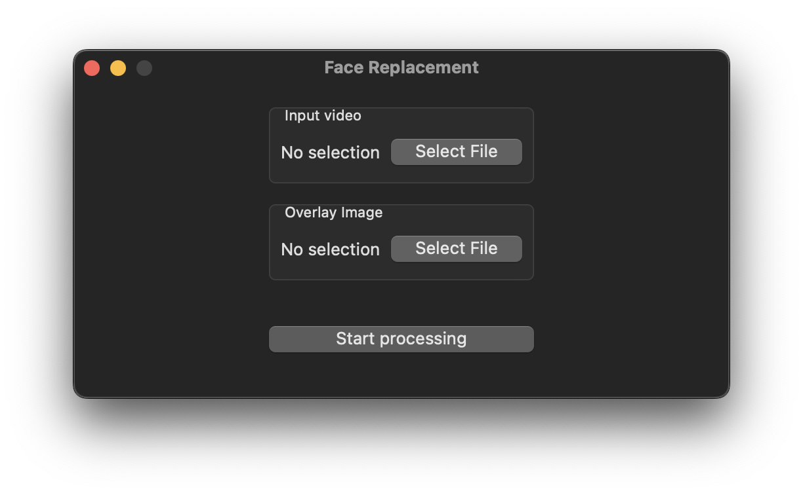

# Face Replacement for MacOS

Simple macOS app that uses Apple's Face detection algorithm to detect faces on a video and add an overlay image on top these faces.

You can use `.mp4` or `.mov` videos with `.jpg` or `.png` images.

The output is always saved to `~/Movies`.

